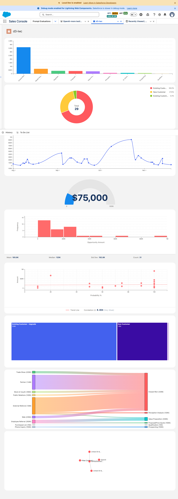

# Salesforce D3.js Chart Component Library

A complete suite of 10 Lightning Web Components (LWC) that wrap D3.js charts for use in Salesforce App Builder, Experience Builder, and Screen Flows. Components are drag-and-drop ready, capable of ingesting raw Salesforce record collections, and intelligently handle aggregation via server-side SOQL GROUP BY (preferred) or client-side JavaScript (fallback).

## Screenshot



## Features

- **10 Chart Types**: Bar, Line, Donut, Gauge, Scatter, Histogram, Treemap, Sankey, Force Graph, Choropleth
- **Drag-and-Drop Ready**: Fully configurable in Lightning App Builder
- **Server-Side Aggregation**: GROUP BY queries run in Apex, processing 50K+ records and sending pre-bucketed results to the browser
- **Dual Data Path**: Server-preferred when `objectApiName` is configured; client-side fallback for `recordCollection` and `soqlQuery`-only usage
- **Server-Side Analytics**: Statistics (mean, median, stdDev) and correlation (Pearson r, linear regression) computed in Apex
- **Responsive**: Uses ResizeObserver for adaptive reflow
- **SLDS Styled**: Consistent with Salesforce Lightning Design System
- **Theme Support**: 4 built-in palettes + custom colors via JSON config
- **Performance Guardrails**: 2,000 record limit on client-side path; no practical limit on server-aggregated path
- **903 Tests**: Comprehensive Jest test coverage across 21 suites

## 📦 Components

| Component | Description | Status | Key Features |
|-----------|-------------|--------|--------------|
| `c-d3-gauge` | Single KPI gauge | Done | Zones, thresholds, color coding |
| `c-d3-bar-chart` | Aggregated bar chart | Done | Vertical bars, drill-down, grid |
| `c-d3-donut-chart` | Part-to-whole | Done | Animated slices, center total, legend |
| `c-d3-line-chart` | Time series | Done | Multi-series, date parsing, curve types |
| `c-d3-scatter-plot` | Correlation | Done | Trend line, Pearson coefficient, point sizing |
| `c-d3-histogram` | Distribution | Done | Auto-binning, normal curve overlay, statistics |
| `c-d3-treemap` | Hierarchical | Done | Nested rectangles, zoom/drill, breadcrumbs |
| `c-d3-sankey` | Flow/process | Done | Nodes + links, gradient colors, flow values |
| `c-d3-force-graph` | Network graph | Done | Force simulation, drag, zoom/pan, node sizing |
| `c-d3-choropleth` | Geographic map | **In Progress** | US states, world, custom GeoJSON, color scales |

## 🏗️ Architecture

```
┌─────────────────────────────────────────────────────────────────┐
│                        SALESFORCE ORG                           │
├─────────────────────────────────────────────────────────────────┤
│  ┌──────────────────┐    ┌──────────────────────────────────┐  │
│  │  Static Resource │    │         Apex Controller          │  │
│  │   (D3.js v7)     │    │   D3ChartController.cls          │  │
│  └────────┬─────────┘    │   - executeQuery(soql)           │  │
│           │              │   - getAggregatedData(GROUP BY)  │  │
│           │              │   - getStatistics(stats)         │  │
│           │              │   - getCorrelation(Pearson r)    │  │
│           │              │   - with sharing (security)      │  │
│           │              └──────────────┬───────────────────┘  │
│           │                             │                       │
│  ┌────────▼─────────────────────────────▼───────────────────┐  │
│  │                    SHARED LWC MODULES                     │  │
│  │  ┌─────────────┐  ┌─────────────┐  ┌─────────────────┐   │  │
│  │  │ dataService │  │themeService │  │  chartUtils     │   │  │
│  │  │ -aggregate  │  │ -palettes   │  │  -resize        │   │  │
│  │  │ -validate   │  │ -getColors  │  │  -tooltip       │   │  │
│  │  │ -truncate   │  │             │  │  -formatters    │   │  │
│  │  └─────────────┘  └─────────────┘  └─────────────────┘   │  │
│  └──────────────────────────┬───────────────────────────────┘  │
│                             │                                   │
│  ┌──────────────────────────▼───────────────────────────────┐  │
│  │                    CHART COMPONENTS                       │  │
│  │  ┌───────┐ ┌─────┐ ┌───────┐ ┌──────┐ ┌─────────┐       │  │
│  │  │ Gauge │ │ Bar │ │ Donut │ │ Line │ │ Scatter │       │  │
│  │  └───────┘ └─────┘ └───────┘ └──────┘ └─────────┘       │  │
│  │  ┌───────────┐ ┌─────────┐ ┌────────┐ ┌───────┐ ┌─────┐ │  │
│  │  │ Histogram │ │ Treemap │ │ Sankey │ │ Force │ │ Map │ │  │
│  │  └───────────┘ └─────────┘ └────────┘ └───────┘ └─────┘ │  │
│  └──────────────────────────────────────────────────────────┘  │
└─────────────────────────────────────────────────────────────────┘
```

## 🚀 Quick Start

### Prerequisites

- Salesforce CLI (`sf`)
- Node.js v20+ (v25 has compatibility issues with SF CLI)
- A Salesforce org with "Enable Local Development" turned on

### Installation

```bash
# Clone the repository
git clone https://github.com/weytani/d3-lwc.git
cd d3-lwc

# Install dependencies
npm install

# Deploy to your org
sf project deploy start --source-dir force-app -o <your-org-alias>
```

### Running Tests

```bash
npm test
```

### Local Development (Hot Reload)

```bash
# Use Node 20 for Salesforce CLI compatibility
export PATH="/opt/homebrew/opt/node@20/bin:$PATH"

# Start the Lightning Dev Server
sf lightning dev app -o <your-org-alias>
```

## 📊 Component Usage

### Common Properties (All Charts)

| Property | Type | Description |
|----------|------|-------------|
| `recordCollection` | Object[] | Data from Flow or parent component |
| `soqlQuery` | String | SOQL query (used if recordCollection empty) |
| `objectApiName` | String | SObject API name — enables server-side aggregation |
| `filterClause` | String | Optional WHERE clause for server aggregation |
| `height` | Integer | Chart height in pixels |
| `theme` | String | Color theme (Salesforce Standard, Warm, Cool, Vibrant) |
| `advancedConfig` | String | JSON for advanced options |

### D3 Bar Chart (Server Aggregation)

```html
<!-- Server-side: aggregates across all matching records via SOQL GROUP BY -->
<c-d3-bar-chart
    object-api-name="Opportunity"
    group-by-field="StageName"
    value-field="Amount"
    operation="Sum"
    filter-clause="IsClosed = false"
    height="300">
</c-d3-bar-chart>
```

### D3 Bar Chart (Client-Side Fallback)

```html
<!-- Client-side: uses recordCollection from Flow or parent component -->
<c-d3-bar-chart
    record-collection={records}
    group-by-field="StageName"
    value-field="Amount"
    operation="Sum"
    height="300">
</c-d3-bar-chart>
```

### D3 Line Chart

```html
<c-d3-line-chart
    soql-query="SELECT CloseDate, Amount FROM Opportunity"
    date-field="CloseDate"
    value-field="Amount"
    curve-type="monotone"
    show-points="true">
</c-d3-line-chart>
```

### D3 Scatter Plot

```html
<c-d3-scatter-plot
    record-collection={records}
    x-field="AnnualRevenue"
    y-field="NumberOfEmployees"
    show-trend-line="true">
</c-d3-scatter-plot>
```

### D3 Choropleth (US States)

```html
<c-d3-choropleth
    record-collection={records}
    region-field="BillingState"
    value-field="Amount"
    map-type="us-states">
</c-d3-choropleth>
```

## 🎨 Themes

Four built-in color palettes:

| Theme | Colors |
|-------|--------|
| **Salesforce Standard** | Brand blue, orange, green, red, purple, pink, cyan, lime |
| **Warm** | Reds, oranges, yellows |
| **Cool** | Blues, purples, cyans |
| **Vibrant** | High-contrast mixed colors |

Custom colors via `advancedConfig`:
```json
{
  "customColors": ["#FF5733", "#33FF57", "#3357FF"]
}
```

## 🛠️ Shared Modules

### dataService

```javascript
import { validateData, prepareData, aggregateData, OPERATIONS } from 'c/dataService';

const { data, truncated } = prepareData(records, { requiredFields: ['Amount'] });
const chartData = aggregateData(records, 'StageName', 'Amount', OPERATIONS.SUM);
```

### themeService

```javascript
import { getColors, createColorScale, THEMES } from 'c/themeService';

const colors = getColors('Warm', 5);
const colorScale = createColorScale('Salesforce Standard', categories);
```

### chartUtils

```javascript
import { formatNumber, formatCurrency, formatPercent, createTooltip } from 'c/chartUtils';

formatNumber(1500000);  // "1.5M"
formatCurrency(50000);  // "$50,000"
```

## 📁 Project Structure

```
d3-lwc/
├── force-app/main/default/
│   ├── classes/
│   │   ├── D3ChartController.cls
│   │   └── D3ChartControllerTest.cls
│   ├── lwc/
│   │   ├── d3Lib/              # D3.js loader
│   │   ├── dataService/        # Data processing
│   │   ├── themeService/       # Color palettes
│   │   ├── chartUtils/         # Shared utilities
│   │   ├── d3Gauge/
│   │   ├── d3BarChart/
│   │   ├── d3DonutChart/
│   │   ├── d3LineChart/
│   │   ├── d3ScatterPlot/
│   │   ├── d3Histogram/
│   │   ├── d3Treemap/
│   │   ├── d3Sankey/
│   │   ├── d3ForceGraph/
│   │   └── d3Choropleth/
│   └── staticresources/
│       ├── d3.js               # D3.js v7
│       └── usStates.js         # US states GeoJSON
├── jest.config.js
├── package.json
├── PROJECT-SPEC.md
├── IMPLEMENTATION-BLUEPRINT.md
└── README.md
```

## 🧪 Testing

```bash
# Run all tests
npm test

# Run specific component tests
npm test -- --testPathPattern=d3BarChart

# Run with coverage
npm test -- --coverage
```

**Test Coverage:** 903 tests across 21 suites (includes server-side aggregation path tests)

## 📚 References

- [D3.js Documentation](https://d3js.org/)
- [Lightning Web Components Guide](https://developer.salesforce.com/docs/component-library/documentation/en/lwc)
- [SLDS Design Tokens](https://www.lightningdesignsystem.com/design-tokens/)

## 📄 License

MIT

---

*Built with ⚔️ by Excalibur*
